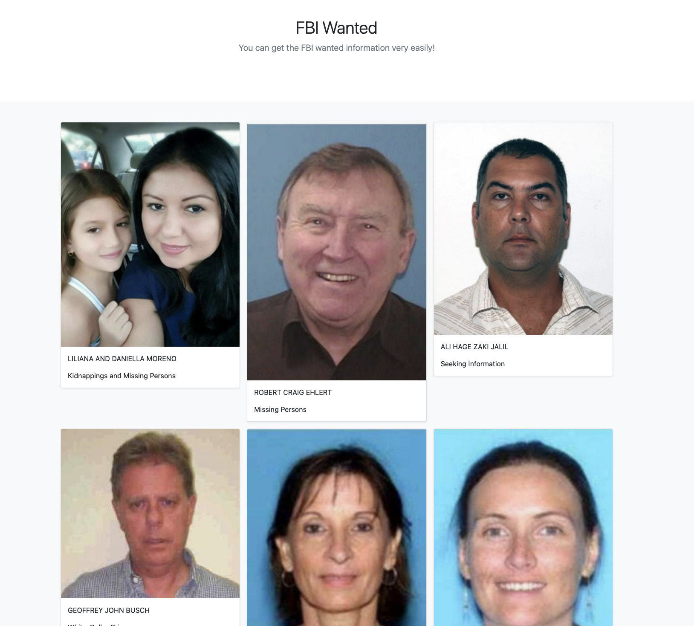

# FBI Wanted

## プロダクト紹介
- FBIの指名手配(失踪情報も含む)を表示するプロダクトです
- FBIのAPIを使ってデータを取ってきています(https://www.fbi.gov/wanted/api)
- 気になるエリアを選択すると、その情報がcsvに保存され、webに写真と名前、情報が表示されます
- csvに保存しないでもwebに表示することはできますが、課題がcsvに保存することだったので、そうしました
- 前回の課題でいろんなAPIを探しているときに、このFBIのAPIに出会い遊ぼうと思いましたが、corsエラーに遭遇し解決できないので棚上げにしていました
- Slackに投稿したら、タロ先生がphpならいけんじゃね？って言ってて、やってみたらいけたので、課題のプロダクトにしました
## 工夫した点、こだわった点
- phpでAPIを実装した
- 今回もbootstrap使ってみた
- csvの列に長さに応じてhtmlにdivを追加して表示するようにした
- 単純に面白いのでみて欲しいww
- 56のfield officeを入力するのが大変だったww
## 苦戦した点、共有したいハマりポイントなど
- phpで配列を扱うのに慣れてなかった
- 多次元配列になったstdClassを使いやすいように変形した
## 感想
- 棚上げにしていた問題が解決してとても嬉しい
- phpとjsは似てるようで違うのでいろいろ苦戦したが、js側をある程度わかっているので、対応づけて進めることができた
- jsノックがここで生きてきた
- 卒制を意識したものではないが、phpの理解はかなり深まった気がする